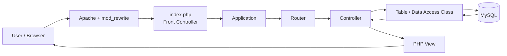
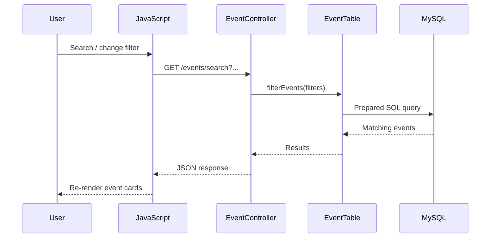
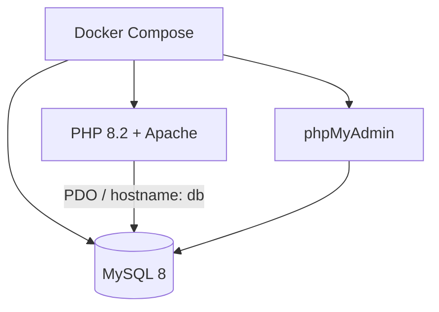

# ⚠️ Important deployment information

> [!IMPORTANT]
> **This repository was originally built as a Docker Compose development environment for an MSc assignment.**
>
> - `compose.yaml` is the **local development setup** and runs the PHP/Apache application, MySQL and phpMyAdmin together.
> - The planned public portfolio deployment is `https://events.sergiupopa.app`.
> - For a Vercel deployment, the PHP/Apache application should be deployed as its own Docker image while the database is hosted separately on a MySQL-compatible service. Vercel does **not** run this repository's full Docker Compose stack.
> - The public deployment is a **portfolio demo**, not a production service. Demo data may be reset and uploaded files may be ephemeral.
> - Scheduled reminder jobs and email delivery are part of the original project implementation, but they do not need to run continuously in the public demo.
> - Keep deployment-specific database settings in environment variables rather than tying the public deployment to the local Docker hostname `db`.
>
> **Local development remains unchanged:** `docker compose up -d --build`

---

# Community Events Management Web Application

A full-stack events management portal developed for the **CSYM019 Internet Programming** module as part of my MSc studies at the University of Northampton.

The application was designed for a community organisation that needs to publish and manage events and workshops. Staff can manage events and blog content through an administrator area, while users can browse events, create accounts, make bookings, filter events dynamically and interact with other public features.

The project combines **PHP, MySQL, JavaScript, AJAX, JSON, HTML, CSS, Apache and Docker** in a custom MVC-style architecture.

## Live demo

**Portfolio demo:** `https://events.sergiupopa.app` *(planned deployment)*

> The hosted version is intended as a demonstration of the application and architecture. Some data or uploads may be periodically reset.

## Key features

### Event management
- Administrator dashboard for creating, editing and deleting events
- Event image uploads with JPG, PNG and WEBP validation
- Public event listing backed by MySQL
- Individual event detail pages
- Event status badges for upcoming, starting-soon and closed events

### Search and filtering
- AJAX-powered search without a full page reload
- Event type, category and location filters
- Date range filtering
- Sorting controls
- Debounced search input to reduce unnecessary requests
- JSON responses rendered dynamically with JavaScript

### Accounts and bookings
- User registration and login
- Password hashing and session-based authentication
- User profile management
- Role-based administrator access
- Event bookings for authenticated users
- Prevention of duplicate bookings
- Prevention of bookings for past events
- Upcoming and previous booking history
- Booking cancellation

### Content and communication
- Administrator-managed blog posts
- Public blog pages
- Contact form
- Newsletter subscriptions
- Booking confirmation emails
- Upcoming-event reminder emails
- Subscriber notifications when new events are created

### Quality and maintainability
- Custom MVC-style architecture
- Front-controller routing
- Reusable database helper
- Dedicated table/data-access classes
- Reusable email service
- Prepared SQL statements
- Server-side form validation
- Escaped dynamic output
- Custom error handling
- Responsive layout
- PHPUnit integration tests

---

## Tech stack

| Area | Technology |
| --- | --- |
| Backend | PHP 8.2 |
| Web server | Apache |
| Database | MySQL 8 |
| Frontend | HTML, CSS, JavaScript |
| Dynamic requests | AJAX / Fetch API |
| Data exchange | JSON |
| Database access | PDO |
| Dependency management | Composer |
| Email | PHPMailer |
| Scheduling | Cron |
| Testing | PHPUnit |
| Containerisation | Docker / Docker Compose |
| Icons | Font Awesome |

No frontend CSS framework was used; the interface and responsive layouts were written with custom CSS.

---

## Architecture

The project uses a custom **MVC-style architecture** to separate request handling, database access, application logic and presentation.



### Request lifecycle

Apache uses `mod_rewrite` and `.htaccess` so non-file requests are sent through `index.php`.

The application then:

1. reads the requested URL;
2. resolves the controller and action through the custom router;
3. executes the controller;
4. retrieves or modifies data through model/table classes;
5. renders the requested PHP template inside the shared layout.

This allows clean routes such as:

```text
/events
/events/show/2
/account
/booking
/admin/create
```

instead of directly exposing individual PHP files.

---

## AJAX workflow

The event filtering system demonstrates the complete frontend-to-backend request flow:



Checkbox filters can send multiple values such as `event_type[]`, `category[]` and `location[]`. The backend dynamically creates named placeholders and binds them through prepared statements rather than inserting user input directly into SQL.

---

## Database

The application separates its data across the following main tables:

| Table | Purpose |
| --- | --- |
| `users` | Registered users and administrators |
| `events` | Event content and event details |
| `bookings` | Links users to booked events |
| `blog_posts` | Public blog / development updates |
| `subscribers` | Newsletter subscriptions |

The `bookings` table creates a many-to-many relationship between users and events and also stores booking-specific information such as confirmation and reminder status.

Database schema and demo seed files are stored in:

```text
db/init/
```

---

## Security features

The project includes several security measures appropriate to the assignment:

- Passwords stored using PHP password hashing
- Session-based authentication
- Role-based administrator access
- PDO prepared statements
- Server-side validation
- `htmlspecialchars()` output escaping
- File-type and size restrictions for uploaded event images
- Restricted administrator routes

The public portfolio deployment should be treated as a **demo environment rather than a production service**.

---

## Email and scheduled reminders

Email functionality is centralised in a reusable `EmailService` built around PHPMailer.

The service supports:

- booking confirmations;
- event reminders;
- new-event notifications for subscribers;
- contact-form messages.

Booking records store whether confirmation and reminder messages have already been sent.

The original Docker environment also includes a cron task that runs the reminder script at one-minute intervals for assignment testing and looks for bookings linked to events occurring within the next 24 hours.

For a portfolio deployment, this scheduled process can be disabled or replaced by the hosting platform's scheduling mechanism.

---

## Testing

The project was tested through both manual browser testing and PHPUnit integration/white-box tests.

Areas tested included:

- user registration and login;
- administrator access restrictions;
- event creation, editing and deletion;
- required-field validation;
- image upload validation;
- event listing;
- keyword search;
- filtering and sorting;
- date-range filtering;
- event detail pages;
- booking creation;
- duplicate-booking prevention;
- past-event booking restrictions;
- booking history and cancellation;
- email-related behaviour;
- responsive layouts;
- Chrome, Firefox and Edge.

PHPUnit tests exercise the main database/table classes, including:

- `EventTable`
- `BlogTable`
- `UserTable`
- `BookingTable`

The original test suite reported:

```text
OK (20 tests, 48 assertions)
```

Run the tests inside Docker with:

```bash
docker compose exec web vendor/bin/phpunit
```

---

## Project structure

```text
.
├── compose.yaml
├── Dockerfile
├── docker-entrypoint.sh
├── db/
│   └── init/
│       ├── 001_schema.sql
│       └── 002_seed.sql
└── src/
    ├── assets/
    ├── config/
    ├── controllers/
    ├── framework/
    ├── javascript/
    ├── models/
    ├── pages/
    ├── scripts/
    ├── styles/
    └── tests/
```

### Main directories

| Directory | Responsibility |
| --- | --- |
| `src/controllers` | Request handling and application actions |
| `src/models` | Models and database table classes |
| `src/pages` | PHP templates / views |
| `src/framework` | Router, application lifecycle, database helpers and shared services |
| `src/javascript` | JavaScript and AJAX behaviour |
| `src/styles` | Application styling |
| `src/assets` | Static assets and event uploads |
| `src/scripts` | Scheduled scripts such as event reminders |
| `src/tests` | PHPUnit tests |
| `db/init` | Database schema and seed data |

---

## Running locally with Docker

### Requirements

- Docker
- Docker Compose

Clone the repository and start the containers:

```bash
docker compose up -d --build
```

The application is then available at:

```text
http://localhost:8080
```

The local development environment also includes phpMyAdmin at:

```text
http://localhost:8081
```

The MySQL container can take a short time to initialise on its first start.

### Stop the environment

```bash
docker compose down
```

### Reset the database

```bash
docker compose down -v
docker compose up -d --build
```

Removing the Docker volume causes the database schema and demo seed data to be recreated the next time the stack starts.

---

## Docker environment

The development environment contains:



Docker provides a reproducible development environment containing the PHP runtime, Apache configuration, MySQL extensions, Composer dependencies and supporting services required by the application.

---

## Notable implementation decisions

### Custom routing

Instead of linking to separate PHP files, the project uses a front controller with a custom `Application` and `Router`. This keeps request handling centralised and allows clean URLs.

### Reusable database access

Common CRUD operations are centralised in a reusable `DatabaseHelper`, while table-specific classes such as `EventTable`, `UserTable`, `BookingTable`, `BlogTable` and `SubscriberTable` contain domain-specific database operations.

### Dynamic filtering

A single filtering system supports keyword search, multiple checkbox values, dates and sorting without requiring separate SQL queries for every possible combination.

### Reusable email service

PHPMailer configuration and shared email layout logic are kept inside one reusable service rather than duplicated across controllers and scripts.

### Progressive enhancement with AJAX

Forms and filters provide dynamic feedback through JavaScript while the backend remains responsible for validation and application rules.

---

## Academic context

This application was originally created for the **CSYM019 Internet Programming** assignment at the University of Northampton.

The assignment required an integrated web application using:

- HTML
- CSS
- JavaScript
- AJAX
- JSON
- PHP
- MySQL

The project was extended beyond the core requirements with authentication, event bookings, a blog system, date-range filtering, email notifications, scheduled reminders, newsletter subscriptions, image uploads and automated tests.

---

## Author

**Sergiu Popa**

Full-stack developer portfolio project / MSc coursework.
